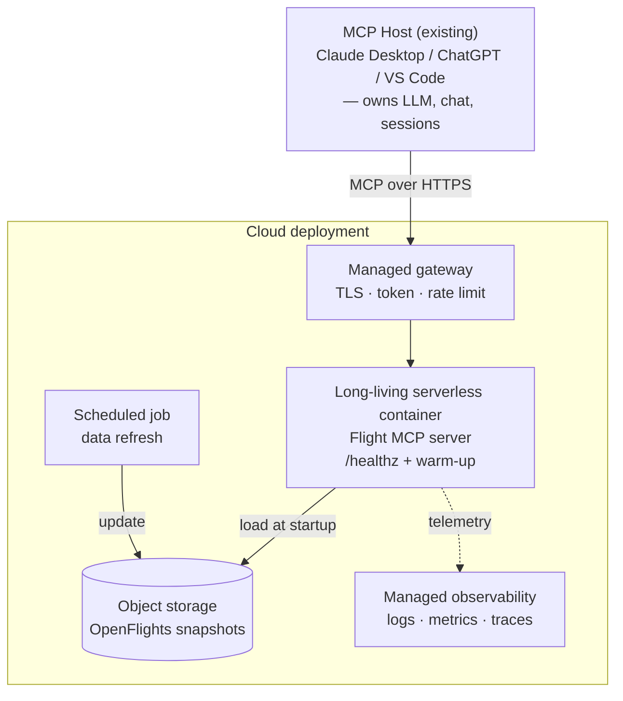

# Architecture

## Code Architecture

```
┌──────────────────────────┐
│  Assistant / Agent layer │  natural language ⇄ tool calls
│  (LLM agent)             │  — never touches data directly
└─────────────┬────────────┘
              │  MCP protocol (streamable HTTP)
┌─────────────▼────────────┐
│   MCP server (tools)     │  find_airports
│   integration boundary   │  find_direct_routes
│                          │  suggest_alternative_routes
└─────────────┬────────────┘
              │  Python calls
┌─────────────▼────────────┐
│  Route discovery domain  │  pure, typed, unit-testable logic
│  service                 │
└─────────────┬────────────┘
              │
┌─────────────▼────────────┐
│  Data access layer       │  the ONLY layer that touches
│  (loader + repository)   │  the network / filesystem
└──────────────────────────┘
```

**Key boundary rule:** the assistant interacts with route data _only_ through
the MCP tools. It never loads files, queries datasets, or calls external
systems. The data layer is the single place that performs I/O.

## Production architecture (for 2 week's plan)



## Prioritization

Must-have:

1. MCP Server with basic evaluation system(Pydantic eval, test as CI(Continuous Integration) pipeline)
1. Security(API Gateway: auth, TLS)
1. Observability
1. Reliability/Performance: stateless tool servers, health checks

Nice-to-have:

1. S3 bucket + periodic refresh data pipeline
1. Ratelimiter
1. CD(Continuous Deployment)

Next step:

1. Multi-hop (>1 stop) routing and geo/time optimization.
1. Full evaluation harness(LLM evlaution on e2e output)
1. Self-implemented/deployed MCP host for enhanced user experience and cost control(currently leverage the existing products in the market like Claude Desktop/Chatgpt)
1. Real-time data pipeline, rich feature support.(More MCP server, Service API + Event/Queues like Kafka)
1. Graduate to a managed container cluster once multiple services need shared.
